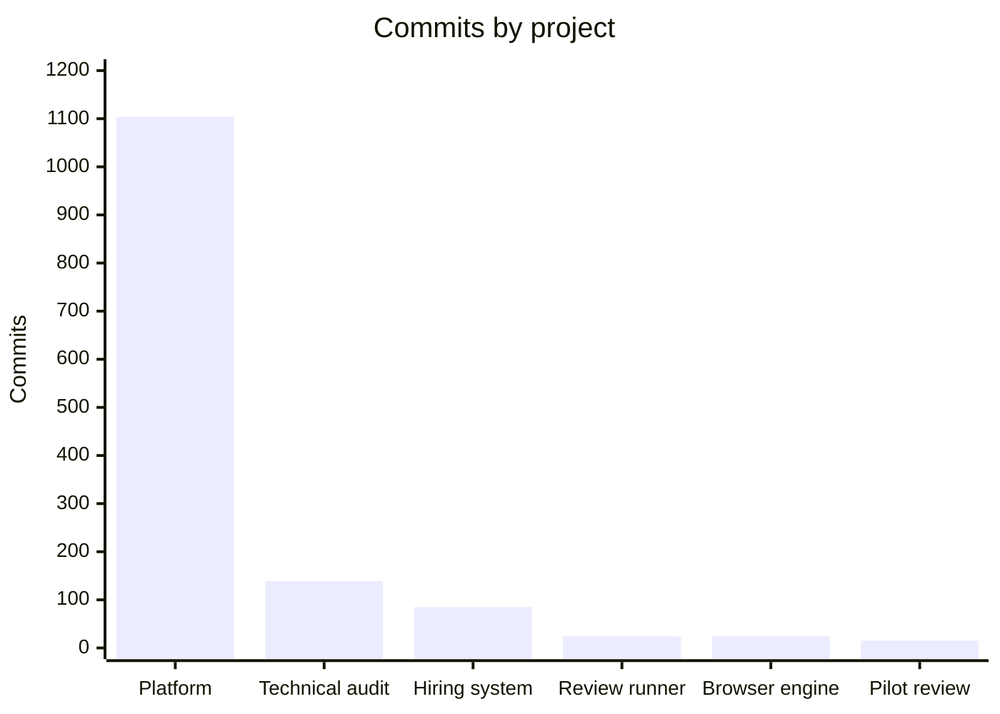
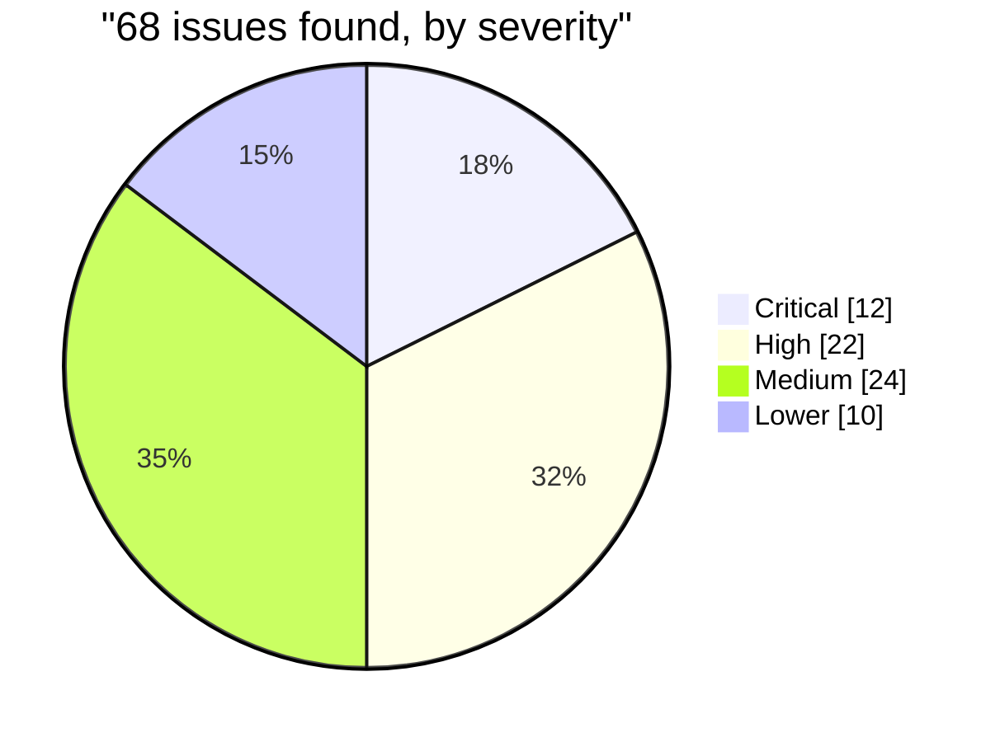
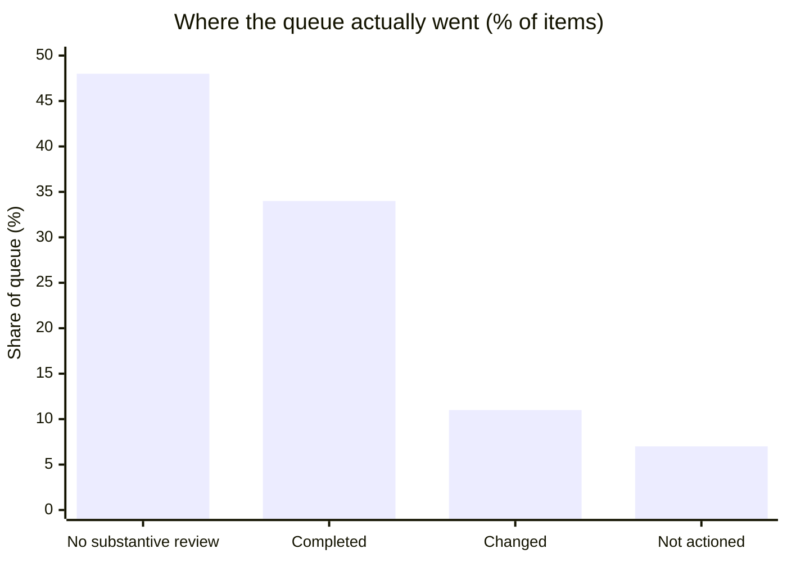
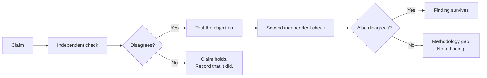
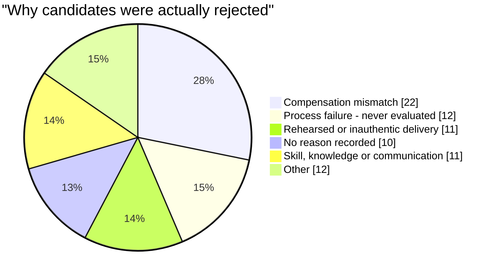
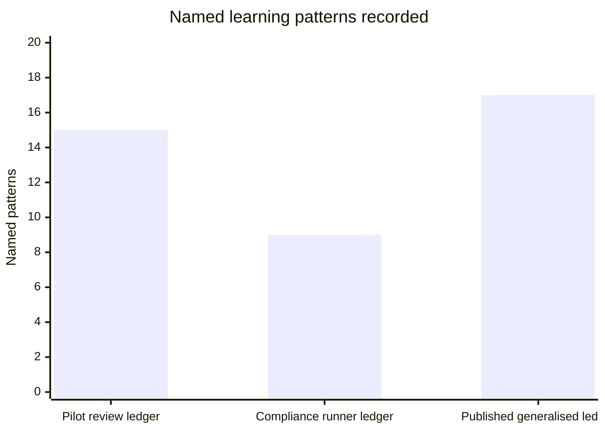

# By the Numbers

Every figure on this page is counted from a repository or measured from a
system, not estimated. Where a number would reveal my employer's
commercial position, it is generalised or omitted — which is why some charts
show shape rather than scale.

---

## What the work returned

Three kinds of outcome: money saved, service improved, and harmful failures
caught before customers saw them.

| | |
|---|---|
| **$3,480–$27,600 / year** | Software cost avoided by building the platform rather than buying comparable software. Benchmarked against published pricing for two mainstream products. Net of the AI spend it cost instead, building it saved money outright. |
| **Zero** | Retraining cost. The platform was built around an existing working method, so it could be introduced without a separate retraining programme. |
| **21** | Severity-1 defects found in a pre-release audit, plus eight mis-detected templates subsequently marked fixed. |

---

## Customer ratings, one month to the next

```mermaid
xychart-beta
    title "Ratings, month over month"
    x-axis ["Positive", "Negative"]
    y-axis "Ratings" 0 --> 90
    bar [14, 21]
    bar [81, 7]
```



First bar is the earlier month, second the later one. **Positive ratings went
from 14 to 81. Negative fell from 21 to 7.**

Two separate things happened and they should not be blended. Total ratings
captured rose from 36 to 89. That shows the feedback loop starting to work, not
a quality change. The movement from 14 to 81 positive and 21 to 7 negative is
the measured outcome of the quality programme.

**111 quality audits** were completed in the earlier month at an average score
of **85.1%**, and 122 the following month at 82.4%. Building the sampling and
feedback loop turned quality from an impression into something measurable and
gave the process a recurring source of evidence.

---

## What got built

Commits per project. All work between 2025 and 2026, alongside a full-time
operations role.



**1,104 commits on the platform — 1,102 under my account.** The remaining
two are not under my account. The platform is roughly 118,000 lines of Python,
built in personal time outside the paid role.

**A commit count is repository activity, not authorship of the code.** AI wrote
most of the implementation. What the commit history actually records is that
every one of those changes was scoped, reviewed and shipped by me — which is
the claim being made here, and the only one these numbers support.

---

## The platform, by output

| | Counted |
|---|---|
| Python | ~118,000 lines |
| **Tests** | **over 3,000** |
| Project documentation | ~64,000 lines |

The published counts describe my own development output. Internal data structures
and application architecture are not published.

---

## Why client context is worth building

A single client history can give the next person handling a case the context
from previous interactions instead of requiring it to be reconstructed from
separate records.

[The case study →](operations-hub/)

---

## An audit, by severity

68 issues found in a self-initiated technical audit, classified and delivered
to leadership as a decision document.



**Half the findings were critical or high.** The severity split is published;
the underlying commercial performance figures are not.

[The method →](seo-audit-toolkit/)

---

## Clearing a compliance backlog

An accumulated regulated review queue, cleared across **two working days** at a
**median of 3.6 seconds** per item.


```

**Roughly half the queue required no substantive review.** That was the largest
single category in the queue.

Two numbers that matter more than the volume:

- **Every action was independently verified** — the check confirmed the intended result rather than relying on the action itself as evidence.
- **73 items were deliberately skipped or aborted** rather than acted on
  uncertainly.

[How it was done →](compliance-review-at-volume/)

---

## Rank claims versus measured reality

A vendor's monthly report claimed specific search rankings. Those claims were
checked against the search platform's own measured position for the same
queries — and then corroborated a second way, against click-through rate.

**Most did not hold up.** A minority were close. Many were off by a wide
margin, including several claimed first-place rankings that were not on the
first page at all. A handful had no measurable visibility whatsoever, which is
incompatible with any claimed rank.

**No figures are published here.** The underlying rankings, impressions and
click-through rates are my employer's commercial performance data, and
they stay private. What generalises is the method — and specifically that a
single check was not enough:


```

The rank claims were the exception. Across the monthly reports as a whole, most
figures matched the source data exactly. Had that not been established first,
the ones that did not would have read as general suspicion rather than a
specific, addressable problem.

[The verification method →](seo-audit-toolkit/VERIFYING_AGENCY_REPORTS.md)

---

## What a hiring funnel was actually filtering on

87 free-text rejection comments, coded into categories.



**A quarter of rejections turned on compensation rather than candidate
quality** — a screening question I could ask at the top of the form instead of
after a conversation. That is a funnel-design decision, not a screening-quality
one, and I could not see it until I counted the reasons rather than read them.

**A seventh related to incomplete applications** rather than to evaluating the
candidate — which identified a step I could move earlier.

One recurring quality judgment, *"reading from a script"*, appeared often enough
to justify defining it explicitly and recording it consistently.

[The method →](hiring-methodology/)

---

## Learnings, written down

Three of the projects here carry a ledger of lessons from building the work,
each generalised into a rule that prevents the same pattern from recurring.



The private ledgers remain unpublished. The published, generalised ledger —
drawn from repeated project work — runs to **17**.

Three independent projects converged on the same one:

> **A check that cannot observe the thing it is checking will pass forever.**

This lesson appeared when a check observed the wrong thing, when a test
duplicated the logic it was meant to challenge, and when a rule could fail
without making that failure visible.

**A clean result reads as good news. That is what makes it dangerous.**

[The ledger →](evidence-discipline/PATTERN_LEDGER.md)

---

## Scope of the operations role

Responsible for operations across multiple functions, and **personally hired and trained about 20
people**.
